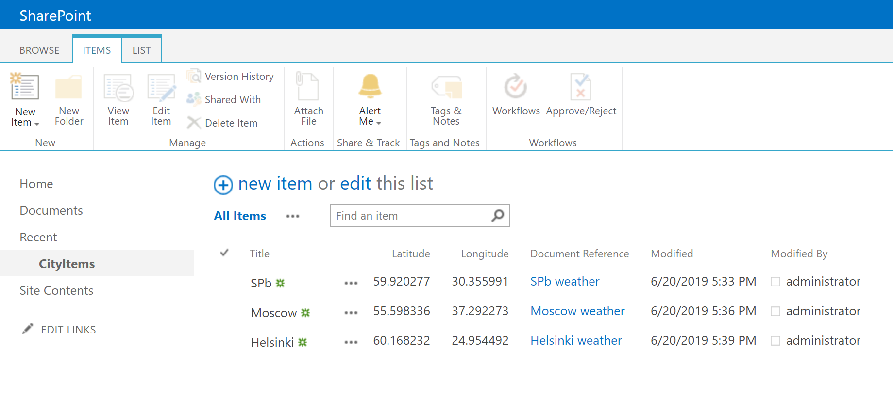

# Introduction

This is the SharePoint 2013 and VS 2015 solution.

It creates CityItems list and CityDocuments library. 
It uses web scope feature.

On CityItem added or updated request to REST service http://gmtinterview.azurewebsites.net goes.

It responses with a weather data json. The json transforms to csv of specified structure that 
is saved in to  CityDocuments library. CityItem contains link to weather csv.

Several tests provided to check structure of csv file.

# Demo

|:-:                                     |:-:                                     |
|||
|||
||

